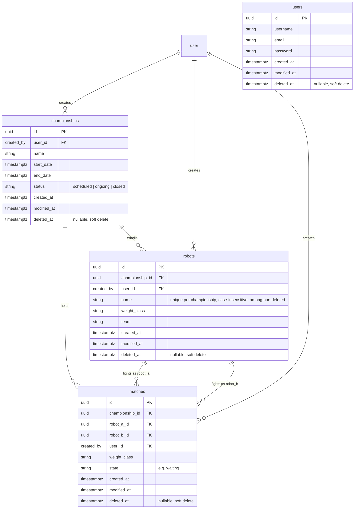

```mermaid
---
config:
  theme: default
  look: classic
  layout: dagre
---
erDiagram
  championships ||--o{ robots : "enrolls"
  championships ||--o{ matches : "hosts"
  robots ||--o{ matches : "fights as robot_a"
  robots ||--o{ matches : "fights as robot_b"
  user ||--o{ championships : creates
  user ||--o{ matches : creates
  user ||--o{ robots : creates

  users {
    uuid id PK
    string username
    string email
    string password
    timestamptz created_at
    timestamptz modified_at
    timestamptz deleted_at "nullable, soft delete"
  }
  championships {
    uuid id PK
    created_by user_id FK
    string name
    timestamptz start_date
    timestamptz end_date
    string status "scheduled | ongoing | closed"
    timestamptz created_at
    timestamptz modified_at
    timestamptz deleted_at "nullable, soft delete"
  }
  robots {
    uuid id PK
    uuid championship_id FK
    created_by user_id FK
    string name "unique per championship, case-insensitive, among non-deleted"
    string weight_class
    string team
    timestamptz created_at
    timestamptz modified_at
    timestamptz deleted_at "nullable, soft delete"
  }
  matches {
    uuid id PK
    uuid championship_id FK
    uuid robot_a_id FK
    uuid robot_b_id FK
    created_by user_id FK
    string weight_class
    string state "e.g. waiting"
    timestamptz created_at
    timestamptz modified_at
    timestamptz deleted_at "nullable, soft delete"
  }
```
