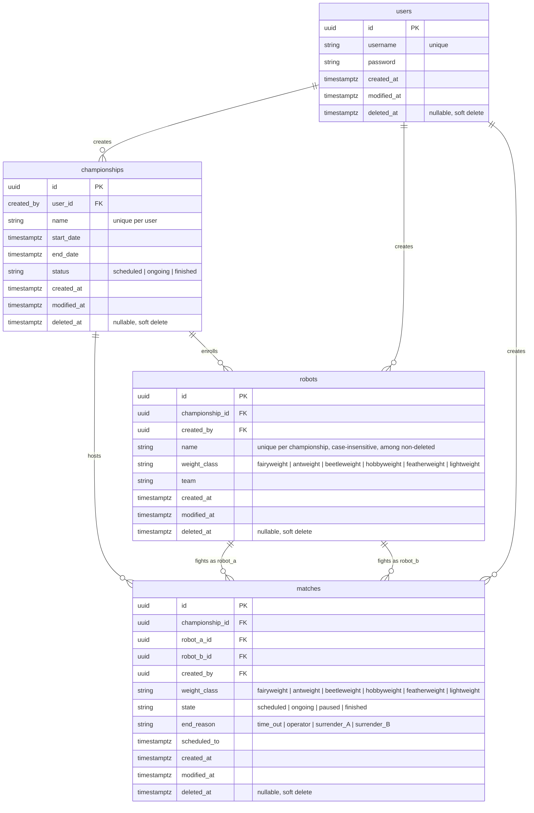

```mermaid
---
config:
  theme: default
  look: classic
  layout: dagre
---
erDiagram
  championships ||--o{ robots : "enrolls"
  championships ||--o{ matches : "hosts"
  robots ||--o{ matches : "fights as robot_a"
  robots ||--o{ matches : "fights as robot_b"
  users ||--o{ championships : creates
  users ||--o{ matches : creates
  users ||--o{ robots : creates

  users {
    uuid id PK
    string username "unique"
    string password
    timestamptz created_at
    timestamptz modified_at
    timestamptz deleted_at "nullable, soft delete"
  }
  championships {
    uuid id PK
    created_by user_id FK
    string name "unique per user"
    timestamptz start_date
    timestamptz end_date
    string status "scheduled | ongoing | finished"
    timestamptz created_at
    timestamptz modified_at
    timestamptz deleted_at "nullable, soft delete"
  }
  robots {
    uuid id PK
    uuid championship_id FK
    uuid created_by FK
    string name "unique per championship, case-insensitive, among non-deleted"
    string weight_class "fairyweight | antweight | beetleweight | hobbyweight | featherweight | lightweight"
    string team
    timestamptz created_at
    timestamptz modified_at
    timestamptz deleted_at "nullable, soft delete"
  }
  matches {
    uuid id PK
    uuid championship_id FK
    uuid robot_a_id FK
    uuid robot_b_id FK
    uuid created_by FK
    string weight_class "fairyweight | antweight | beetleweight | hobbyweight | featherweight | lightweight"
    string state "scheduled | ongoing | paused | finished"
    string end_reason "time_out | operator | surrender_A | surrender_B"
    timestamptz scheduled_to
    timestamptz created_at
    timestamptz modified_at
    timestamptz deleted_at "nullable, soft delete"
  }
```
