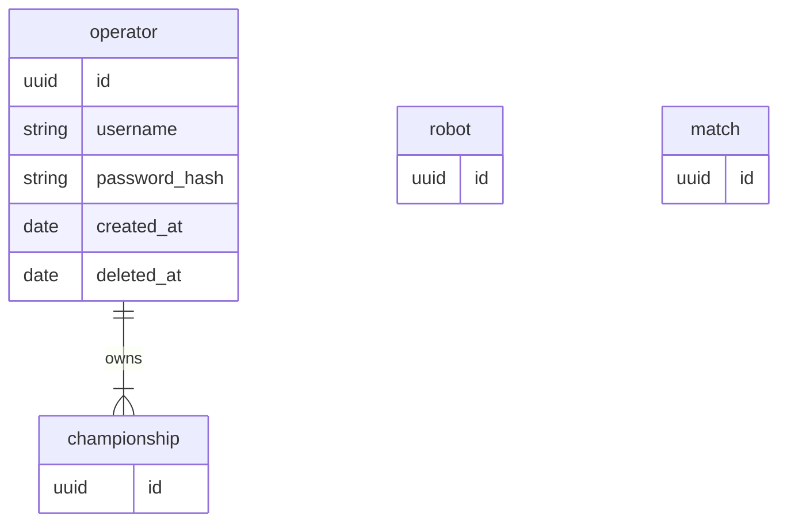

```mermaid
---
config:
  theme: default
  look: classic
  layout: dagre
---
erDiagram
  operator ||--|{ championship : owns
  operator {
    uuid id
    string username
    string password_hash
    date created_at
    date deleted_at
  }
  championship {
    uuid id
  }
  robot {
    uuid id
  }
  match {
    uuid id
  }
```
